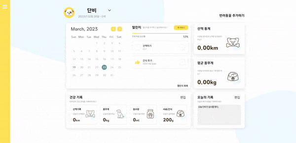
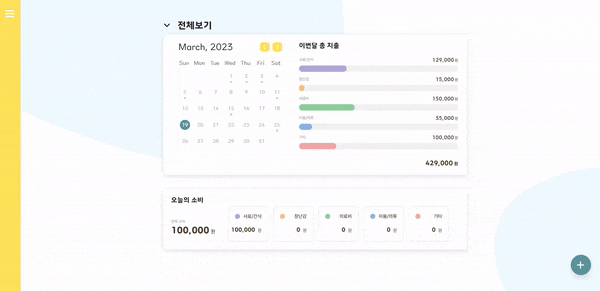
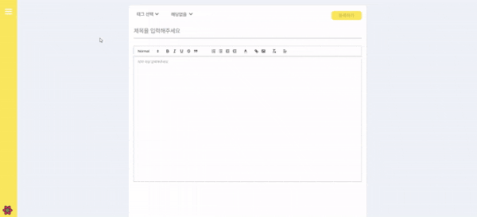
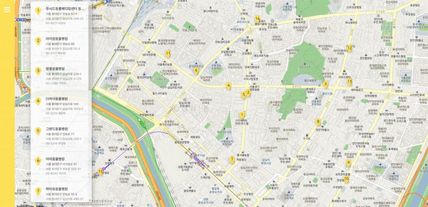
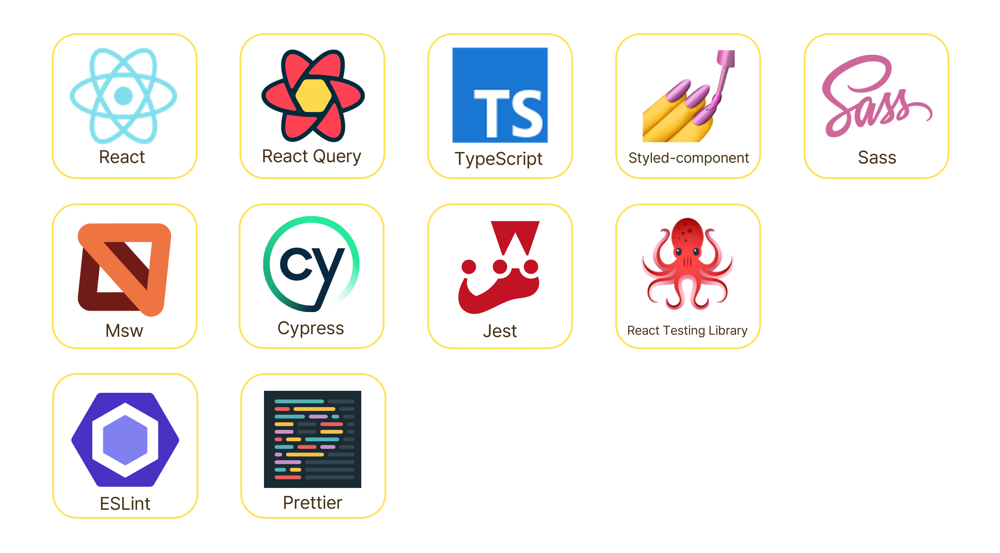
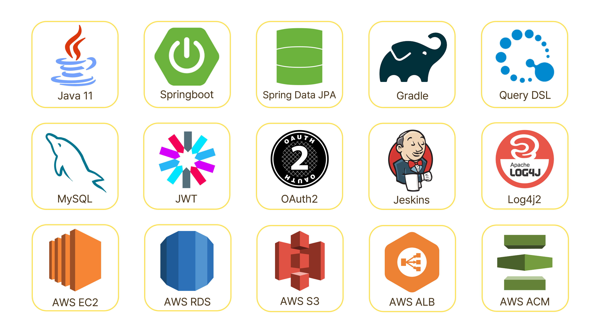

	<h1>소중한 반려견을 관리하는 서비스, With pet</h1>
	

# 프로젝트 소개

with pet은 반려견의 하루하루를 기록하는 서비스입니다. with pet을 통해서 반려견을 관리하고 커뮤니티도 참여해보세요    

# 핵심 기능

🚀 다이어리를 통해 주 단위로 챌린지를 추가하고, 반려견의 건강을 관리할 수 있습니다.   

🚀 가계부를 통하여 반려견에 대한 소비를 기록하고, 각 반려견 별로 지출을 관리할 수 있습니다.   

🚀 위치 기반 커뮤니티를 통하여 반려견 관련한 소통과 반려견 카페, 병원에 대한 정보를 공유할 수 있습니다.    

🚀 내 주변 동물 병원을 찾을 수 있습니다.   

# 🛠 프로젝트 기술 스택

 
<h2 align="left">프론트앤드</h2> 
  
 
 
<h2 align="left">백앤드</h2> 
    
   

   
   

# 팀원

| Designer | Backend | Backend | Frontend | Frontend |
| :-: | :-: | :-: | :-: | :-: |
|  |  |  |  |  |
| [김유리](https://github.com/reachyusam)  | [Seunghee Jin](https://github.com/Jin409)  | [min1998](https://github.com/Lee-Sang-Min1998)  | [최규호 (Choi Gyu Ho)](https://github.com/gyuhoBest)  | [윤다솜 (Dasom Yun)](https://github.com/datoybi)  |

  
 
